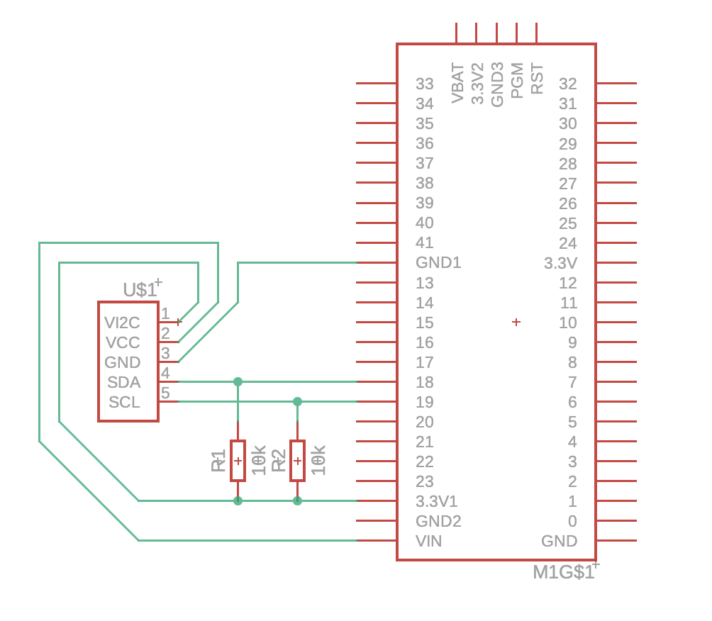

# 14 Segment, 4 Digits Display

Sample project for a 4 characters/digits 14 Segment Display.

Configured for a Teensy 4.1 and a Adafruit Style Display.

Runs the "quadalphanum" sample program provided in the Adafruit LED Backpack Library

## Schema

